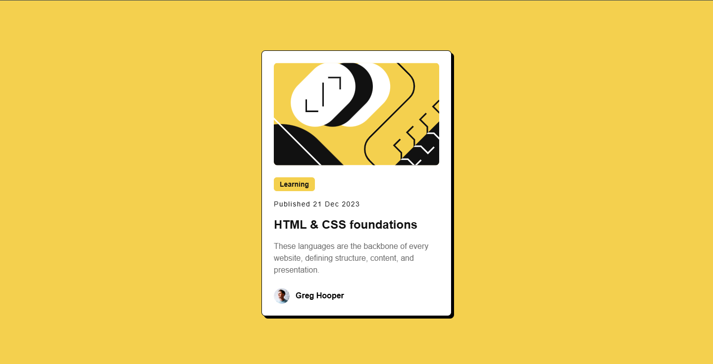
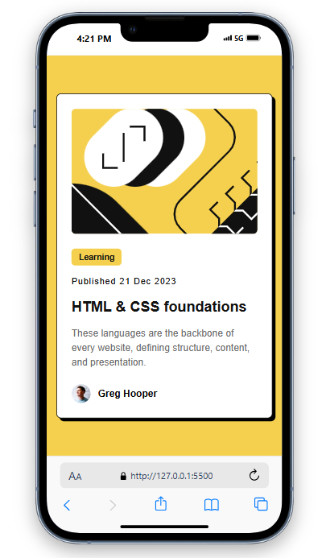

# Frontend Mentor - Blog Preview Card

This is a solution to the [Blog Preview Card challenge](https://www.frontendmentor.io/challenges/blog-preview-card-ckPaj01IcS) from Frontend Mentor. The goal of the challenge is to create a responsive blog preview card using HTML, CSS, and basic design principles.

## Overview

This project showcases a blog preview card with an image, title, description, and author information. It is designed to be responsive, ensuring a smooth user experience across devices.

### Features

- Responsive layout
- Clean and minimalist design
- Hover effect for the card

## Screenshot

## Links

- Live Site: [Blog-Preview-Card](https://blog-preview-card-ranjithk.netlify.app/)
- Solution: [Frontend Mentor Blog Preview Card Solution](https://www.frontendmentor.io/solutions/blog-preview-card-using-tailwindcss-UsbDOkWSNA)

## My Process

1. **Design**: Followed the design provided by Frontend Mentor.
2. **HTML Structure**: Created the basic HTML structure for the card.
3. **CSS Styling**: Used Flexbox for responsive layout and added hover effects for interactivity.
4. **Testing**: Ensured the card looks great on various screen sizes.

## Built with

- HTML5
- CSS3 (TailwindCss)

## Author

- Frontend Mentor - [@Ranjith K](https://www.frontendmentor.io/profile/thisisranjithk)

